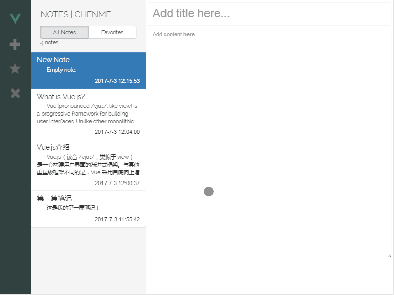

# 基于vue2.0 + vuex + bootstrap 开发的本地笔记应用

> 本应用采用 vue 2.0 + vuex + bootstrap + webpack + localStorage, 实现了一个简单的类似于Evernote的本地笔记应用。

## 功能说明

- 支持添加笔记
- 支持编辑笔记
- 支持删除笔记
- 支持星标/取消星标笔记
- 支持本地化存储

## 安装步骤
本项目是使用vue-cli脚手架生成的项目，可以从我的github上clone下来

  ``` bash
  git clone https://github.com/chenmf6/vue-note.git
  cd vue-note
  npm install
  npm run dev
  ```

## 功能演示



## 主要难点

### 1. 状态管理

难点：状态需要在多个组件之间共享，而且状态的改变要实时显示。

解决方法：使用vuex进行状态管理，把所有笔记和相关状态都存储在store对象中，并在组件中按需访问。

### 2. 本地存储

知识点：使用localStorage可以在本地长久存储数据

主要方法：
  1) 存储数据：localStorage.setItem(item, value)
  2) 获取数据：localStorage.getItem(item)
